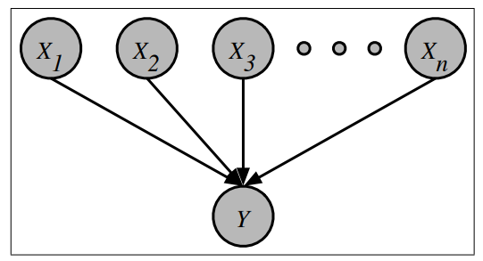
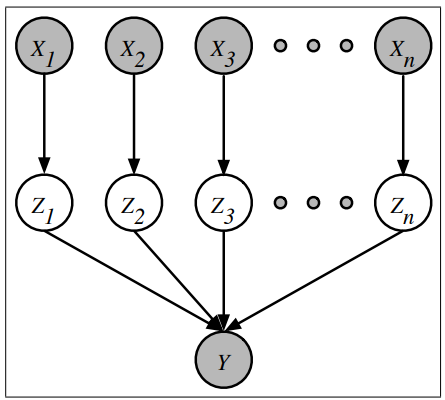

# Expectation-Maximization

This project derives and implements an expectation-maximization algorithm for estimating the noisy-OR parameters

## Noisy-OR

Consider the belief network below, with binary random variables $X \in \{0,1\}^n$ and $Y \in \{0,1\}$ and a noisy-OR conditional probability table (CPT).

The noisy-OR CPT is given by:
$$P(Y=1|X)\ =\ 1-\prod_{i=1}^n\left(1-p_{i}\right)^{X_i},$$
which is expressed in terms of the noisy-OR parameters $p_i \in [0,1]$.

## Equivalent form of the model

This project derives and implements an EM algorithm for estimating the noisy-OR parameters $p_i$. It may seem that the EM algorithm is not suited to this problem, in which all the nodes are observed, and the CPT has a parameterized form. In fact, the EM algorithm can be applied, but first, we must express the model in a different but equivalent form.

Consider the belief network shown above. In this network, a binary random variable $Z_{i} \in \{0,1\}$ intercedes between each pair of nodes $X_i$ and $Y$. Suppose that:

$$\begin{eqnarray*}
P(Z_{i}=1|X_i=0) & = & 0, \\
P(Z_{i}=1|X_i=1) & = & p_{i}. 
\end{eqnarray*}$$

Also, let the node $Y$ be ${\it determined}$ by the logical-OR of $Z_{i}$. In other words:

$$P(Y = 1|Z)\ =\ \left\\{\begin{array}{l}
1\ \mbox{if}\ Z_{i}=1\ \mbox{for any}\ i, \\
0\ \mbox{if}\ Z_{i}=0\ \mbox{for all}\ i.
\end{array}
\right.$$

## Properties

The equivalent belief network has the following properties:

* This "extended" belief network defines the same conditional distribution $P(Y|X)$ as the original one. In particular, the right-hand side of the following equation reduces to the noisy-OR CPT with parameters $p_i$.

$$P(Y = 1|X)\ = \sum_{Z\in\{0,1\}^n} P(Y = 1,Z|X)$$

* Consider estimating the noisy-OR parameters $p_i$ to maximize the (conditional) likelihood of the observed data. The (normalized) log-likelihood in this case is given by:
$${\cal L}\ =\ \frac{1}{T}\sum_{t=1}^T \log P(Y = y^{(t)}|X = \vec{x}^{(t)}),$$
where $(\vec{x}^{(t)},y^{(t)})$ is the $t^{th}$ joint observation of $X$ and $Y$, and where for convenience we have divided the overall log-likelihood by the number of examples $T$.  From the previous property, it follows that we can estimate the parameters $p_i$ in either the original network or the extended one (since in both networks they would be maximizing the same equation for the log-likelihood).

* Notice that in the extended network, we can view $X$ and $Y$ as observed nodes and $Z$ as hidden nodes.  Thus in this network, we can use the EM algorithm to estimate each parameter $p_i$, which simply defines one row of the "look-up" CPT for the node $Z_i$. The posterior probability, that appears in the E-step of this EM algorithm, for joint observations $x \in \{0,1\}^n$ and $y \in \{0,1\}$, is given by:

$$P(Z_{i} = 1,X_i = 1|X = x,Y = y)\ =\ \frac{y x_i p_{i}}{1-\prod_j (1-p_{j})^{x_j}}$$

* For the data set $\{\vec{x}^{(t)},y^{(t)}\}^T_{t=1}$, the EM update for the parameters $p_i$ is given by:
$$p_{i}\ \leftarrow\ \frac{1}{T_i} \sum_t P\left(Z_{i} = 1,X_i = 1|X = x^{(t)},Y = y^{(t)}\right),$$
where $T_i$ is the number of examples in which $X_i = 1$.

## EM algorithm in action

Here, the EM algorithm is used to estimate the parameters $p_i$. The data set has $T = 267$ examples over $n = 23$ inputs. All parameters are initialized to $p_{i} = 0.05$, 256 iterations of the EM algorithm are performed and the log-likelihood is computed at each iteration. This log-likelihood always increases from one iteration to the next. The number of mistakes $M\leq T$ made by the model is also computed at each iteration; a mistake occurs either when $y_t = 0$ and $P(y_t = 1|\vec{x}_t)\geq 0.5$ (indicating a false positive) or when $y_t = 1$ and $P(y_t = 1|\vec{x}_t)\leq 0.5$ (indicating a false negative). The number of mistakes should generally decrease as the model is trained, though it is not guaranteed to do so at each iteration. The following table reports all the quantities.

  
| Iteration | number of mistakes $M$ | log-likelihood ${\cal L}$ |
| --- | --- | --- |
| 0 | 175 | -0.95809 |
| 1 | 56 | -0.49592 |
| 2 | 43 | -0.40822 |
| 4 | 42 | -0.36461 |
| 8 | 44 | -0.34750 |
| 16 | 40 | -0.33462 |
| 32 | 37 | -0.32258 |
| 64 | 37 | -0.31483 |
| 128 | 36 | -0.31116 |
| 256 | 36 | -0.31016 |

